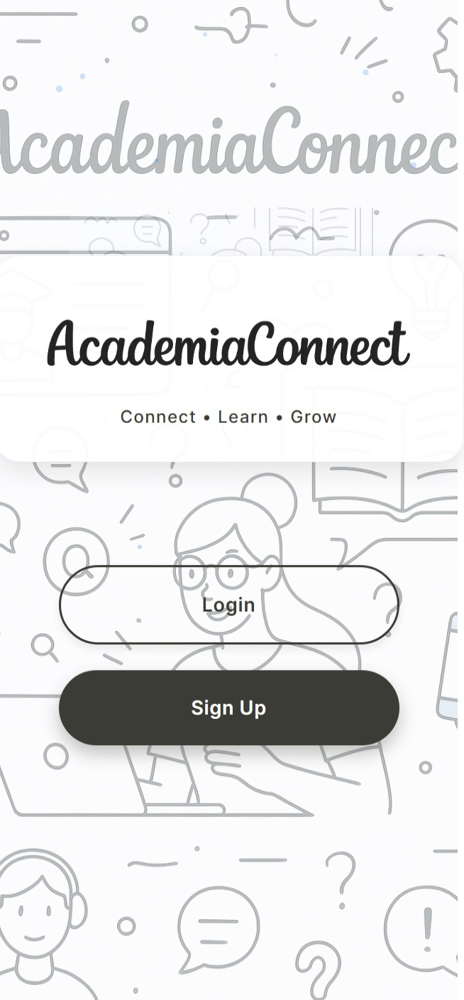
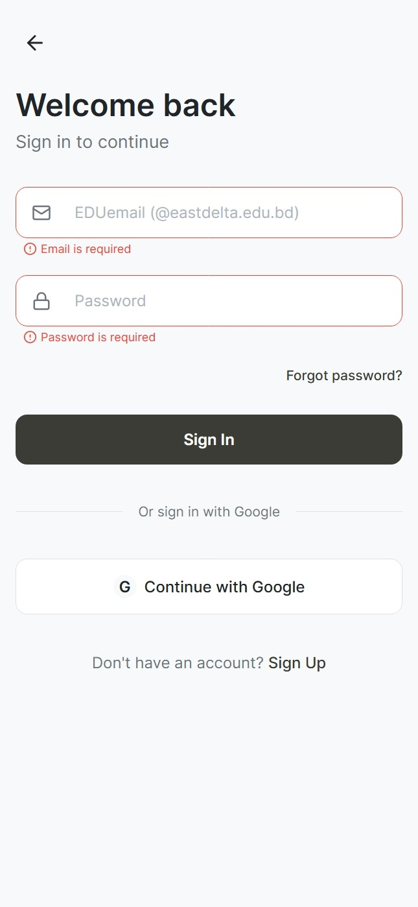
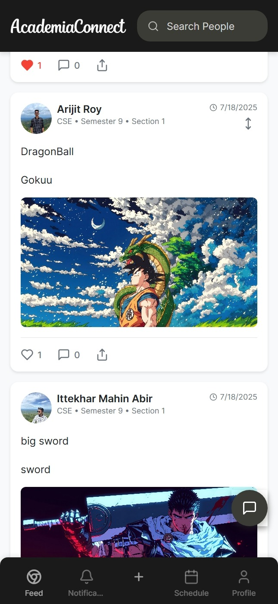
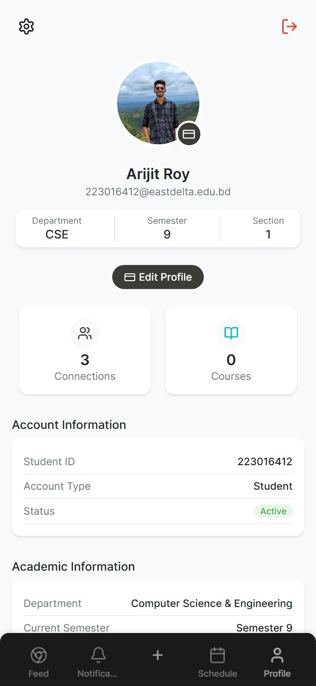
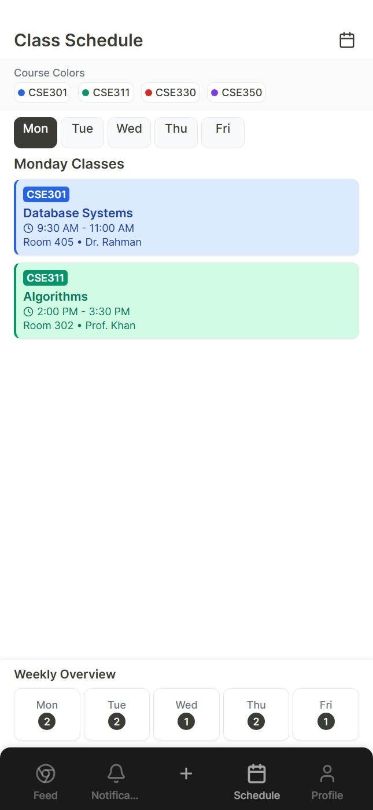
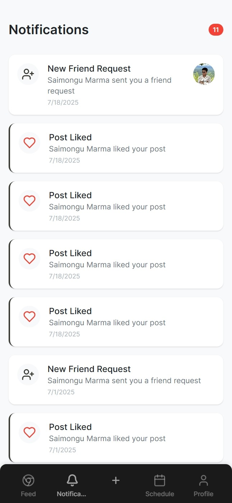

<div align="center">
  
  
  **A comprehensive social networking platform designed specifically for East Delta University students to connect, share, and collaborate within their academic community.**

[](https://reactnative.dev/)
[](https://expo.dev/)
[](https://www.typescriptlang.org/)
[](https://supabase.com/)
[](LICENSE)

</div>

---

## 📚 Quick Navigation

**📖 Documentation Hub**

- 🗄️ **[Database Schema](DATABASE.md)** - Complete database documentation, table structures, and relationships
- 🚀 **[API Reference](API.md)** - Comprehensive REST API endpoints and authentication guide
- 📱 **[Main Documentation](#)** - You are here! Project overview and setup guide

---

## 📋 Table of Contents

- [Overview](#overview)
- [Features](#features)
- [Technical Architecture](#technical-architecture)
- [Installation & Setup](#installation--setup)
- [Development Guide](#development-guide)
- [Project Structure](#project-structure)
- [Contributing](#contributing)
- [Documentation](#documentation)

---

## 📱 Screenshots

<div align="center">
  <table>
    <tr>
      <td align="center">
        
        <br/>
        <strong>Welcome Screen</strong>
      </td>
      <td align="center">
        
        <br/>
        <strong>Login Screen</strong>
      </td>
      <td align="center">
        
        <br/>
        <strong>Feed Screen</strong>
      </td>
    </tr>
    <tr>
      <td align="center">
        
        <br/>
        <strong>Profile Screen</strong>
      </td>
      <td align="center">
        
        <br/>
        <strong>Schedule Screen</strong>
      </td>
      <td align="center">
        
        <br/>
        <strong>Notification Screen</strong>
      </td>
    </tr>
  </table>
</div>

---

## 🎯 Overview

Academia Connect is a modern, feature-rich social networking platform built specifically for East Delta University. It combines social media functionality with academic tools to create a comprehensive ecosystem for students and faculty to interact, share knowledge, and manage their academic life.

### Key Highlights

- 🎓 **Academic-First Design**: Built specifically for university environments
- 🔐 **Secure Authentication**: EDU email validation and secure session management
- 📱 **Cross-Platform**: Native iOS, Android, and Web support via Expo
- ⚡ **Real-Time Features**: Live messaging, notifications, and updates
- 🎨 **Modern UI/UX**: Clean, accessible design with dark/light theme support
- 🔒 **Privacy-Focused**: Comprehensive RLS policies and data protection

---

## ✨ Features

### 🔐 Authentication & Security

- **EDU Email Validation**: Restricted to `@eastdelta.edu.bd` emails - [API Details](API.md#sign-up)
- **Secure Session Management**: JWT-based authentication with Supabase - [Auth Flow](API.md#authentication-flow)
- **Profile Creation**: Comprehensive academic profile setup - [Database Schema](DATABASE.md#profiles---user-information)
- **Avatar Management**: Image upload and management system - [Upload API](API.md#upload-avatar)
- **Session Persistence**: Automatic login state management
- **Google OAuth**: Alternative sign-in method (configured)

### 👥 Social Features

- **Dynamic Feed**: Personalized content feed with friend posts and announcements - [Feed API](API.md#get-feed-posts)
- **Post Creation**: Rich text posts with image attachments - [Create Post API](API.md#create-post)
- **Engagement System**: Like and comment functionality - [Likes](API.md#likes) & [Comments](API.md#comments)
- **Real-Time Updates**: Live feed updates using Supabase subscriptions
- **Content Moderation**: Announcement system for official communications
- **Media Sharing**: Image upload and display with optimized storage - [Posts Schema](DATABASE.md#posts---social-content)

### 🤝 Friend System

- **Friend Requests**: Send, receive, accept, and reject friend requests - [Friend Requests API](API.md#friend-requests)
- **Bidirectional Relationships**: Automatic mutual friendship creation - [Friendships Schema](DATABASE.md#friendships---user-relationships)
- **Friend Management**: View and manage friend connections - [Friendships API](API.md#friendships)
- **Real-Time Notifications**: Instant friend request notifications
- **Privacy Controls**: Friend-only content visibility - [RLS Policies](DATABASE.md#security-policies)

### 👤 Profile Management

- **Academic Profiles**: Department, semester, section information
- **Role-Based System**: Student and faculty role distinction
- **Profile Editing**: Comprehensive profile update functionality
- **Avatar System**: Profile picture upload and management
- **Academic Information**: Student ID, department affiliation, current semester

### 🔍 Search & Discovery

- **User Search**: Search by name or email with real-time results
- **Advanced Filters**: Department and semester-based filtering
- **Friend Status**: Visual indicators for friend relationships
- **Quick Actions**: Direct friend request sending from search results

### 💬 Messaging System (In Development)

- **Real-Time Messaging**: Instant message delivery - [Messages API](API.md#send-message)
- **Direct Messages**: One-on-one conversations - [Conversations API](API.md#conversations)
- **Group Chats**: Multi-user conversation support - [Conversation Schema](DATABASE.md#conversations---chat-threads)
- **Media Sharing**: Image, document, and file sharing
- **Read Receipts**: Message read status tracking
- **Typing Indicators**: Real-time typing status
- **Message Threading**: Reply-to-message functionality - [Messages Schema](DATABASE.md#messages---chat-system)

### 📅 Schedule Management (In Development)

- **Course Enrollment**: Join and manage course schedules
- **Schedule Display**: Visual timetable representation
- **Time Conflict Detection**: Automatic scheduling conflict resolution
- **Faculty Schedule Management**: Instructor schedule creation and management
- **Academic Calendar**: Important dates and events

### 🔔 Notification System

- **Real-Time Notifications**: Instant push notifications
- **Notification Types**: Friend requests, post interactions, announcements
- **Notification Management**: Mark as read, bulk actions
- **Customizable Settings**: Notification preferences

---

## 🏗️ Technical Architecture

### Frontend Stack

```
React Native 0.79.0
├── Expo SDK ~53.0.11          # Development platform and build tools
├── TypeScript ~5.3.0          # Type safety and developer experience
├── Expo Router ~5.1.0         # File-based navigation system
├── React Navigation 7.0.0     # Navigation library
├── Formik 2.4.6              # Form handling and validation
├── Yup 1.3.3                 # Schema validation
├── Lucide React Native        # Icon system
├── React Native Reanimated    # Animations and gestures
└── Expo Vector Icons          # Additional icon sets
```

### Backend Stack

```
Supabase (Backend-as-a-Service)
├── PostgreSQL Database        # Primary data storage
├── Row Level Security (RLS)   # Data access policies
├── Real-time Subscriptions   # Live data updates
├── Authentication            # User management and JWT
├── Storage                   # File and media storage
├── Edge Functions           # Serverless functions
└── Database Functions       # Custom PostgreSQL functions
```

### Development Tools

```
Development Environment
├── Expo CLI                  # Development server and build tools
├── Metro Bundler            # JavaScript bundler
├── Babel                    # JavaScript transpiler
├── ESLint                   # Code linting
├── Prettier                 # Code formatting
└── TypeScript Compiler     # Type checking
```

---

## 🚀 Installation & Setup

### Prerequisites

Ensure you have the following installed:

- **Node.js** (v16 or higher)
- **npm** or **yarn**
- **Expo CLI** (`npm install -g @expo/cli`)
- **Git**
- **iOS Simulator** (macOS) or **Android Studio** (for Android development)

### Environment Setup

1. **Clone the Repository**

   ```bash
   git clone https://github.com/aroyy007/AcademiaConnectApp.git
   cd academiaconnectapp
   ```

2. **Install Dependencies**

   ```bash
   npm install
   # or
   yarn install
   ```

3. **Environment Configuration**

   Create a `.env` file in the root directory:

   ```env
   # Supabase Configuration
   EXPO_PUBLIC_SUPABASE_URL=your_supabase_project_url
   EXPO_PUBLIC_SUPABASE_ANON_KEY=your_supabase_anon_key

   # Optional: Google OAuth (if using)
   EXPO_PUBLIC_GOOGLE_CLIENT_ID=your_google_client_id
   ```

4. **Supabase Setup**

   - Create a new Supabase project at [supabase.com](https://supabase.com)
   - Run the SQL scripts in the `supabase/` directory in order:
     ```bash
     # Execute these in your Supabase SQL editor
     1. create_core_tables_and_policies.sql
     2. create_messaging_tables_and_rls.sql
     3. create_storage_buckets_and_policies.sql
     4. seed_departments_courses_schedules.sql
     ```
   - Configure Storage buckets for `avatars`, `posts`, and `messages`
   - Set up authentication providers if using OAuth

5. **Start Development Server**

   ```bash
   npm start
   # or
   expo start
   ```

6. **Run on Device/Simulator**
   - **iOS**: Press `i` in the terminal or scan QR code with Camera app
   - **Android**: Press `a` in the terminal or scan QR code with Expo Go app
   - **Web**: Press `w` in the terminal

---

## 👨‍💻 Development Guide

### Project Structure

```
academia-connect/
├── app/                          # Expo Router pages
│   ├── (tabs)/                   # Tab-based navigation
│   │   ├── feed.tsx             # Main feed screen
│   │   ├── profile.tsx          # User profile screen
│   │   ├── schedule.tsx         # Schedule management
│   │   ├── notifications.tsx    # Notifications screen
│   │   └── create.tsx           # Post creation screen
│   ├── index.tsx                # Welcome/landing screen
│   ├── login.tsx                # Authentication screen
│   ├── signup.tsx               # Registration screen
│   └── _layout.tsx              # Root layout configuration
├── components/                   # Reusable UI components
│   ├── auth/                    # Authentication components
│   ├── messaging/               # Chat and messaging components
│   ├── profile/                 # Profile-related components
│   └── ui/                      # Generic UI components
├── constants/                    # Design system constants
│   ├── colors.ts               # Color palette
│   ├── typography.ts           # Font and text styles
│   └── spacing.ts              # Spacing and border radius
├── hooks/                       # Custom React hooks
│   ├── useAuth.ts              # Authentication logic
│   ├── usePosts.ts             # Post management
│   ├── useFriends.ts           # Friend system logic
│   ├── useMessages.ts          # Messaging functionality
│   └── useSchedule.ts          # Schedule management
├── lib/                         # External service integrations
│   └── supabase.ts             # Supabase client and helpers
├── types/                       # TypeScript type definitions
│   ├── database.ts             # Database schema types
│   └── env.d.ts                # Environment variable types
├── utils/                       # Utility functions
│   ├── imageUtils.ts           # Image processing helpers
│   └── validation.ts           # Form validation schemas
├── supabase/                    # Database schema and migrations
│   ├── create_core_tables_and_policies.sql
│   ├── create_messaging_tables_and_rls.sql
│   └── seed_departments_courses_schedules.sql
├── assets/                      # Static assets
│   └── images/                 # App images and icons
├── package.json                # Dependencies and scripts
├── app.json                    # Expo configuration
├── tsconfig.json               # TypeScript configuration
└── README.md                   # Project documentation
```

---

## 🤝 Contributing

We welcome contributions from the community! Here's how you can help:

### Getting Started

1. **Fork the Repository**

   ```bash
   git clone https://github.com/aroyy007/AcademiaConnectApp.git
   cd academia-connect
   ```

2. **Create a Feature Branch**

   ```bash
   git checkout -b feature/amazing-feature
   ```

3. **Make Your Changes**

   - Follow the code style guidelines
   - Add tests for new functionality
   - Update documentation as needed

4. **Commit Your Changes**

   ```bash
   git commit -m "Add amazing feature"
   ```

5. **Push to Your Branch**
   ```bash
   git push origin feature/amazing-feature
   ```

---

## 📚 Documentation

For detailed technical information, please refer to our comprehensive documentation:

### 🗄️ [Database Documentation](DATABASE.md)

Complete database schema documentation including:

- Table structures and relationships
- Row Level Security (RLS) policies
- Database setup and migration scripts
- Seeding instructions and sample data

### 🚀 [API Documentation](API.md)

Comprehensive REST API reference covering:

- Authentication and authorization
- All endpoint specifications with examples
- Request/response formats
- Error handling and status codes
- Rate limiting and security considerations

---

## 🔗 See Also

**Related Documentation:**

- **[Database Schema](DATABASE.md#core-tables)** - Detailed table structures for profiles, posts, and friendships
- **[Authentication API](API.md#authentication)** - Complete authentication flow and security implementation
- **[Social Features API](API.md#social-features)** - Posts, likes, comments, and friend system endpoints
- **[Messaging System](DATABASE.md#messaging-relationships)** - Real-time chat database design and [API endpoints](API.md#messaging-system)
- **[Academic Features](DATABASE.md#academic-tables)** - University-specific tables and [course management API](API.md#academic-features)

**Development Resources:**

- **[Database Setup Guide](DATABASE.md#database-setup)** - Step-by-step database configuration
- **[API Authentication](API.md#authentication-flow)** - JWT token management and security
- **[Error Handling](API.md#error-handling)** - Comprehensive error codes and troubleshooting

---

## 📞 Support

If you encounter any issues or have questions:

- **GitHub Issues**: [Create an issue](https://github.com/aroyy007/AcademiaConnectApp.git/issues)
- **Documentation**: Check this README and inline code comments
- **Community**: Join our Discord server for discussions
- **Email**: contact@academiaconnect.edu (for urgent matters)

---

## 📖 Documentation Navigation

**Quick Links:**

- **[🗄️ Database Schema](DATABASE.md)** - Complete database documentation
- **[🚀 API Reference](API.md)** - REST API endpoints and examples
- **[📱 Main Documentation](#)** - Project overview and setup (current page)

**Key Sections:**

- [Installation & Setup](#installation--setup) - Get started with development
- [Technical Architecture](#technical-architecture) - System design overview
- [Features](#features) - Complete feature documentation
- [Contributing](#contributing) - How to contribute to the project

---

<div align="center">
  <p>Arijit Roy, Ittekhar Mahin Abir, Raheta Sadeka</p>
  <p>CSE 464 - App Development Course</p>
  <p>East Delta University</p>
  <p>© 2025 Academia Connect. All rights reserved.</p>
</div>
